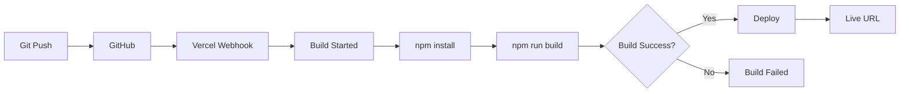

# 🚀 Guide de Déploiement Vercel - AIDYN Landing

## ✅ Prérequis

- [x] Compte Vercel actif
- [x] Repository GitHub configuré
- [x] Code pushé sur GitHub
- [x] Build Next.js fonctionnel (`npm run build`)

## 🔗 Configuration Automatique Vercel

### Méthode 1 : Via Dashboard Vercel (Recommandé)

1. **Connectez-vous** à [vercel.com](https://vercel.com)

2. **Créer un Nouveau Projet**
   - Cliquez sur "Add New Project"
   - Ou visitez : https://vercel.com/new

3. **Importer depuis GitHub**
   - Sélectionnez "Import Git Repository"
   - Choisissez `masterDakill/aidyn-landing`
   - Autorisez Vercel à accéder au repo (si première fois)

4. **Configuration du Projet**
   ```
   Framework Preset: Next.js
   Root Directory: ./
   Build Command: npm run build
   Output Directory: .next
   Install Command: npm install
   Development Command: npm run dev
   ```

5. **Variables d'Environnement** (Optionnel)
   ```
   NEXT_PUBLIC_ANALYTICS_ID=votre_id_analytics
   NEXT_PUBLIC_SITE_URL=https://aidyn-landing.vercel.app
   ```

6. **Déployer**
   - Cliquez sur "Deploy"
   - Attendez le build (2-3 minutes)
   - Récupérez l'URL de production

### Méthode 2 : Via Vercel CLI (Avancé)

```bash
# Installer Vercel CLI
npm install -g vercel

# Se connecter à Vercel
vercel login

# Naviguer vers le projet
cd /home/user/webapp

# Déployer
vercel --prod

# Suivre les prompts pour configurer
```

## 🔄 Déploiement Automatique

Une fois configuré, Vercel déploie automatiquement :

### Branches Surveillées
- **main** → Production deployment
- **genspark_ai_developer** → Preview deployment
- Toute autre branche → Preview deployment

### Workflow Automatique



### Déclencheurs
- ✅ Push sur main → Production
- ✅ Push sur autre branche → Preview
- ✅ Pull Request → Preview avec URL unique
- ✅ Merge PR → Production update

## 📊 Vérifier le Status du Déploiement

### Via Dashboard
1. Allez sur https://vercel.com/dashboard
2. Sélectionnez `aidyn-landing`
3. Onglet **Deployments** → Voir l'historique
4. Onglet **Settings** → Configurer les options

### Status du Déploiement
- 🟡 **Building** - En cours de construction
- 🟢 **Ready** - Déployé et accessible
- 🔴 **Error** - Échec du déploiement
- 🔵 **Queued** - En attente

## 🌐 URLs de Déploiement

### Production (main branch)
```
https://aidyn-landing.vercel.app
https://aidyn-landing-[votre-username].vercel.app
```

### Preview (genspark_ai_developer branch)
```
https://aidyn-landing-[hash].vercel.app
```

### Custom Domain (si configuré)
```
https://aidyn-tech.com
https://www.aidyn-tech.com
```

## 🔧 Configuration Avancée

### vercel.json (Optionnel)

Créer `vercel.json` à la racine pour configuration avancée :

```json
{
  "buildCommand": "npm run build",
  "devCommand": "npm run dev",
  "installCommand": "npm install",
  "framework": "nextjs",
  "regions": ["iad1"],
  "functions": {
    "api/**/*.ts": {
      "memory": 1024,
      "maxDuration": 10
    }
  },
  "headers": [
    {
      "source": "/(.*)",
      "headers": [
        {
          "key": "X-Frame-Options",
          "value": "SAMEORIGIN"
        },
        {
          "key": "X-Content-Type-Options",
          "value": "nosniff"
        }
      ]
    }
  ]
}
```

### Environment Variables

**Via Dashboard** : Settings → Environment Variables

Variables recommandées :
```
NEXT_PUBLIC_ANALYTICS_ID=UA-XXXXXXXXX-X
NEXT_PUBLIC_SITE_URL=https://aidyn-landing.vercel.app
NODE_ENV=production
```

## 🐛 Troubleshooting

### Build Fails

**Erreur**: "Build failed"
```bash
# Tester localement
npm run build

# Vérifier les logs
# Dashboard → Deployments → Sélectionner le deployment → View Build Logs
```

**Solutions communes**:
- Vérifier `package.json` scripts
- Résoudre les erreurs TypeScript
- Corriger les imports manquants
- Vérifier les variables d'environnement

### Deployment Takes Too Long

**Raisons possibles**:
- Trop de dépendances npm
- Build complexe
- Images non optimisées

**Solutions**:
- Utiliser `npm ci` au lieu de `npm install`
- Activer le cache Vercel
- Optimiser les images

### 404 on Deployment

**Vérifier**:
- Output directory est bien `.next`
- Build command est `npm run build`
- Pas d'erreurs de build

## 📈 Monitoring

### Analytics Vercel
- **Real-time visitors**
- **Page performance**
- **Core Web Vitals**
- **Geographic distribution**

### Logs
```
Dashboard → Project → Deployments → [Select] → Runtime Logs
```

## 🔒 Sécurité

### Protection de Branches
Settings → Git → Protected Branches
- Activer protection pour `main`
- Require approvals pour PRs

### Preview Deployments
Settings → Git → Preview Deployments
- Activer pour toutes les branches
- Désactiver si confidentialité requise

## ✅ Checklist Pré-Déploiement

- [ ] `npm run build` réussit localement
- [ ] `npm run lint` - Pas d'erreurs
- [ ] Variables d'environnement configurées
- [ ] Images optimisées
- [ ] Meta tags SEO présents
- [ ] Tests passent
- [ ] README.md à jour

## 🎯 Post-Déploiement

### Vérifications
- [ ] Site accessible via URL
- [ ] Toutes les pages chargent
- [ ] Images s'affichent
- [ ] Formulaires fonctionnent
- [ ] Analytics actifs
- [ ] Mobile responsive
- [ ] Performance > 90 (Lighthouse)

### Custom Domain

1. **Ajouter un domaine**
   - Dashboard → Project → Settings → Domains
   - Cliquez "Add Domain"
   - Entrez votre domaine

2. **Configurer DNS**
   ```
   Type: A
   Name: @
   Value: 76.76.21.21

   Type: CNAME
   Name: www
   Value: cname.vercel-dns.com
   ```

3. **SSL/TLS**
   - Automatique via Let's Encrypt
   - Certificate provisionné en ~10 minutes

## 📞 Support

- **Documentation** : https://vercel.com/docs
- **Status Page** : https://vercel-status.com
- **Community** : https://github.com/vercel/vercel/discussions
- **Support** : support@vercel.com

---

**Projet** : AIDYN Landing  
**Repository** : https://github.com/masterDakill/aidyn-landing  
**Last Updated** : 2025-10-24
